# LLM Study-Notes⏰

   🌐 <a href="https://github.com/FabinGL" target="_blank">Github</a> • 📃  <a href="https://fabingl.github.io/" target="_blank">HomePage</a>  

在这个笔记中我会分享一些我个人学习ChatGPT以及LLM大语言模型的过程经历，同时也会记录一些代码上的坑。实际上最近不止玩了LLM还玩了图像的模型，但是现在这个已经很成熟了，所以等以后有空研究研究再写吧。
本人以下操作基于以下电脑配置完成💻。
- CPU:5900X
- GPU:3080Ti O12G
- 内存:32G
- Windows 11

实在穷啊，别人都是拿几张A100玩，我就只能拿自己的个人电脑玩一下了😭。

## Introdation
大语言模型（英文：Large Language Model，缩写LLM），也称大型语言模型，是一种人工智能模型，旨在理解和生成人类语言。它们在大量的文本数据上进行训练，可以执行广泛的任务，包括文本总结、翻译、情感分析等等。LLM的特点是规模庞大，包含数十亿的参数，帮助它们学习语言数据中的复杂模式。这些模型通常基于深度学习架构，如转化器，这有助于它们在各种NLP任务上取得令人印象深刻的表现。

目前我使用的大语言模型分别有以下两种，分别是GPT3.5与国内清华与智谱华章所发行的ChatGLM模型，接下来我会对这两个模型进行系统性的说明与比较。

## GPT3.5
目前对于GPT3.5所配置的API已经可以玩出很多花来了。一般在直接在OPENAI的网站上使用是免费的。如果你要使用接下来的模型就要去OPENAI拿账户的API，我是同学帮我拿的，由于我经常被OPENAI墙😥。**使用OPENAI的API的，LLM模型都是在云端计算的，不需要自身电脑的算力。**

### GPT3.5的配置
这个没有什么困难的，只需要照着OPENAI官网的来就好了，一般就是给个KEY然后GIT一下仓库，jupyter notebook里就可以直接调用了。但是主要就是要钱。效果就可以不用多说了，目前最强的。基本问题他都能解决，这个一般人也都够用了。

#### GPT构建个人网站和小程序API接口
这个点名表扬一下胡同学找到的好东西，找到了这么一个好玩意给我们用。拿出GPT的API以后可以[制作小程序](https://github.com/waylaidwanderer/node-chatgpt-api)以及[构建个人GPT网站](https://github.com/Yidadaa/ChatGPT-Next-Web)。具体教程可以在Google上搜一搜。都是教程。基本就是Fork一下然后稍微配置一下就可以使用了。目前我是配置了我自己的个人ChatGPT的网站，挺好用的。稀土掘金的教程里还说可以配置自己的域名然后就不用挂梯子了。我比较懒就没去配置。但是足够使用了。不配置域名的话也只要挂梯子就可以使用了。这里的梯子的节点就不一定要在美国了，使用官网的GPT服务需要节点挂在美国然后经常被墙，自己的GPT网站不指定挂哪里的梯子，只要挂了梯子都能用，目前还没崩溃过的情况。非要说BUG的话，我之前有一次在别的电脑使用发现他输出在前端网页展示不完整，不过这个应该是前端的问题。目前也就出现过一次，大致是可以忽略的。

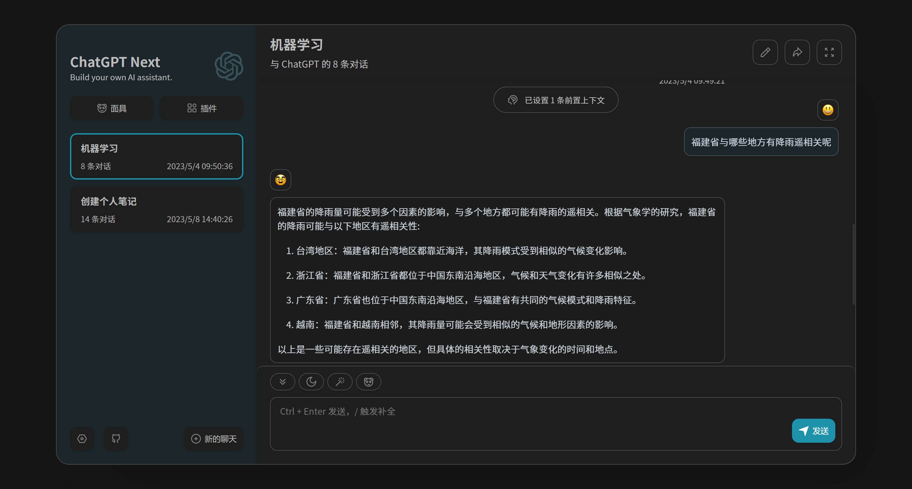
可以看到他懂的非常多，由于我最近在进行一些大气学科以及机器学习交叉的工作，所以我也经常问他问题，大气学科的专业名词它也能够答上来，真的很厉害了，强推同学们构建一个自己的网站。

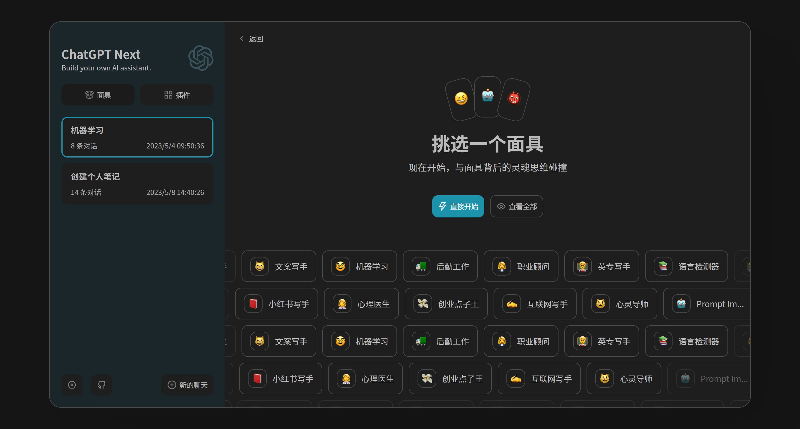
在和ChatGPT聊天之前可以先指定他的运用场景，他可以充当小红书写手，练习雅思的工具等等。非常好用。

### Visual ChatGPT
这个更是个重量级产品，实际上就是GPT4了，在图像领域真的和造神一样。你可以叫他分割图像，也可以叫他生成图，叫他理解图片，不过这个非常吃显存。点这里可以转跳到他的[Guithub项目](https://github.com/microsoft/TaskMatrix)。

可以看到它可以根据你的要求生成图片，提取出线稿等等，最近Diffusion又出来一个模型叫做ControlNet,具体配置可以看[B站的教程](https://www.bilibili.com/video/BV1fa4y1G71W/?spm_id_from=333.999.0.0&vd_source=628628960a416b6de42d5c7fdc17a7fc)（这个模型也很有趣，以后有时间做图像方面的笔记再细聊吧）。Visual ChatGPT在图像方面实现的功能很大程度和ControlNet重叠，不过Visual ChatGPT可以实现图生文的功能。还是那句话：术业有专攻嘛，大家想要真的生成好的图像还是去试试已经完善的扩散生成模型。Visual ChatGPT所能实现的具体所有功能如下图所示:
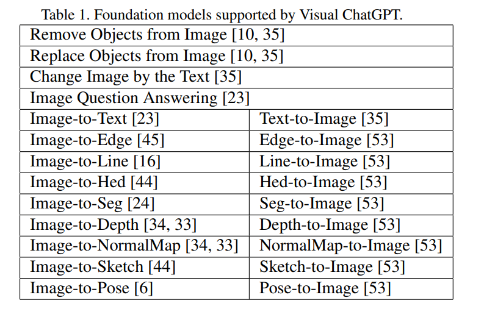

Visual ChatGPT配置的话就是分为以下几步:
- Windows电脑需要先下载Git工具，Linux电脑则不用了
- 在你想要安装的地址运行win+R输入CMD打开命令行
- 运行`git clone https://github.com/microsoft/visual-chatgpt.git`，这里要挂梯子。
- 创建新环境，当然这里可以用自己已经有的环境。`conda create -n visgpt python=3.8`
- 激活环境`conda activate visgpt`
- 安装依赖`pip install -r requirements.txt`
- 这里有两个指令分别针对Linux和Windows的，这里的Your_Private_Openai_Key要替换成自己的:
  - windows运行`set OPENAI_API_KEY={Your_Private_Openai_Key}`
  - Linux运行`export OPENAI_API_KEY={Your_Private_Openai_Key}`
- 接着就可以在命令行打开`python visual_chatgpt.py --load "ImageCaptioning_cuda:0,Text2Image_cuda:0"`
这里的模型(Imagecaptioning,Text2Image)是可以组合着来的，也可以指定部署在不同的显卡上(Cuda:n)，其中ChatGPT是利用云端计算返回的结果，所以不占用电脑算力，但是生成图像的过程是在本地电脑上生成的。所以电脑还是需要提供生成图像所要的算力。在我的电脑上启动上述两个模型大概使用了7.5G的显存。**需要注意的是ImageCaptioning这个模块是一定要加载的，不然会报错**(要生成图像首先要了解图像嘛)。**还有一个一定一定要注意的点,所有的图像生成模型下载下来大概在200G上下,大家一定要注意下自己的硬盘容量是否足够！！**

具体算力要求如下:
| Foundation Model        | GPU Memory (MB) |
|------------------------|-----------------|
| ImageEditing           | 3981            |
| InstructPix2Pix        | 2827            |
| Text2Image             | 3385            |
| ImageCaptioning        | 1209            |
| Image2Canny            | 0               |
| CannyText2Image        | 3531            |
| Image2Line             | 0               |
| LineText2Image         | 3529            |
| Image2Hed              | 0               |
| HedText2Image          | 3529            |
| Image2Scribble         | 0               |
| ScribbleText2Image     | 3531            |
| Image2Pose             | 0               |
| PoseText2Image         | 3529            |
| Image2Seg              | 919             |
| SegText2Image          | 3529            |
| Image2Depth            | 0               |
| DepthText2Image        | 3531            |
| Image2Normal           | 0               |
| NormalText2Image       | 3529            |
| VisualQuestionAnswering| 1495            |

所以要运行所有的模型大概需要40G的显存，我玩不起，希望以后可以玩一下吧TAT。

 
上面这张图就是Visual ChatGPT基本的流程结构图，可以看到他就是以ChatGPT作为一个“大脑”来控制其他的“眼睛”（图像模型）的。我上面也提到过，只不过大脑在云端，眼睛是在自己电脑上，所以需要显存运行。

目前我自己也部署好了这个模型，尝试了一下效果，其实效果并不是很好，比如我给他的指令是“画一个亚洲女人”，但是他有时会画出脸崩坏的女人。猫狗的效果都还可以。但是真人图画出来不太好看（相比于专业的扩散模型）。这很明显是本地图像模型生成的问题，不是模型的理解有误（ChatGPT部署在云端，并且我给的关键词很简单）。但实际上我尝试了一下，在专门的扩散生成的模型里输入同样的提示词效果也差不多。所以的话我觉得这是Chatgpt理解后生成的提示词不是很对，在扩散生成模型里面有一个专门的反推提示词的模型叫做`Tagger`，就是我们输入一张图像，他就能生成这个图像的提示词。我觉得未来真要改进的话，这个是一个方向。也就是
**输入->ChatGLM+Tagger耦合->输入扩散生成模型->生成图像->输出**这种结构，我觉得可以实现。（不过我也是个小菜鸡，这只是我的一个拙见）。

下面就是一些我运行的结果图，我测试了他文生图和看图说话的能力。
- 文生图的能力
   - 让Visual ChatGPT给我画一只猫。
   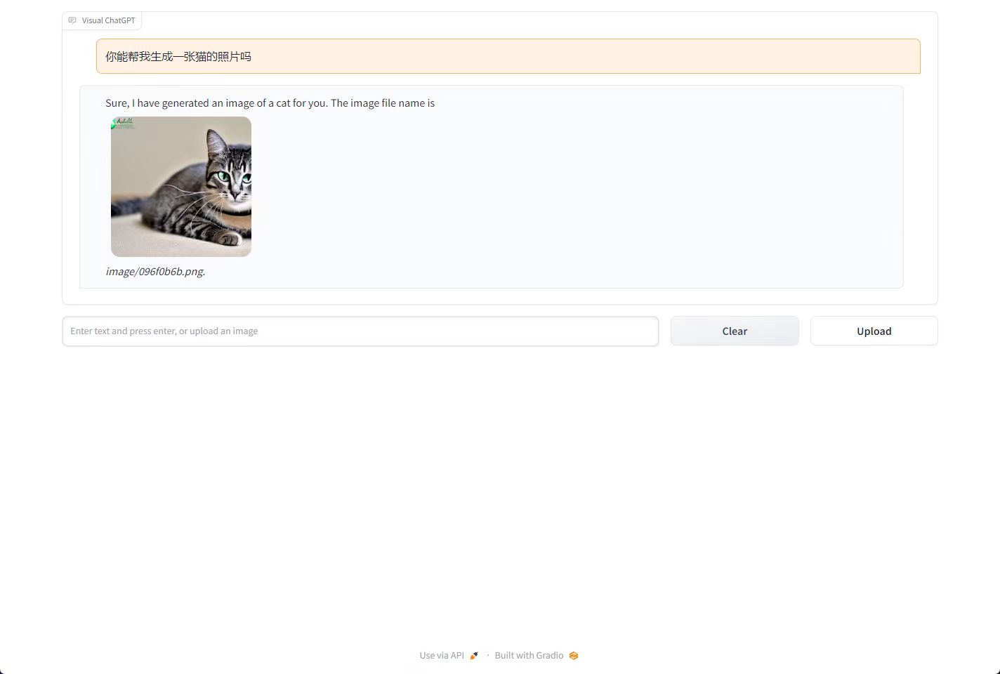
   - 让Visual ChatGPT给我画一个我们Lab的Logo
   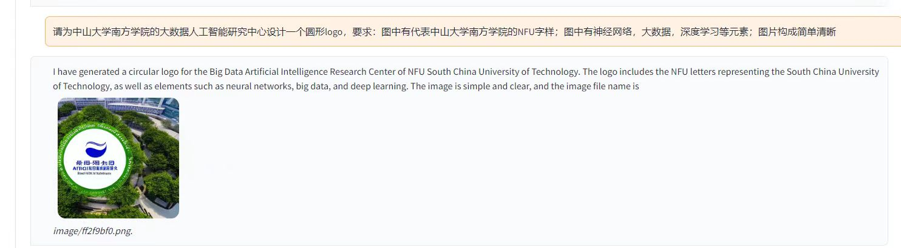
   - 让Visual ChatGPT帮我生成一个亚洲女人的形象，呃怎么说呢，其实不算崩坏，只是不符合现在的审美，感觉有点像十年前的照片？
   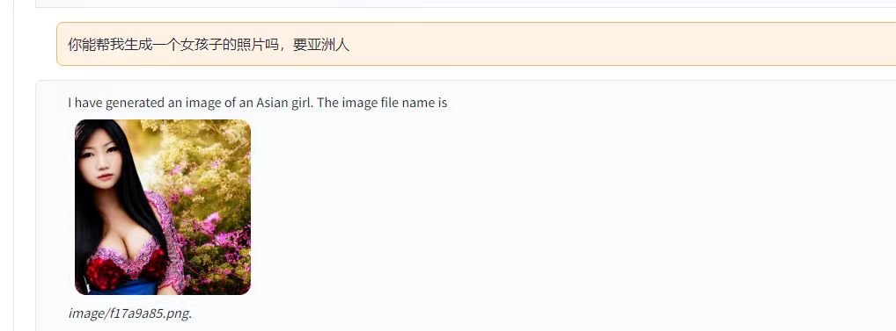

- 图生文的能力
   - 让Visual ChatGPT判断图像里有什么？（感谢吴同学假期出游提供的素材哈哈哈）
   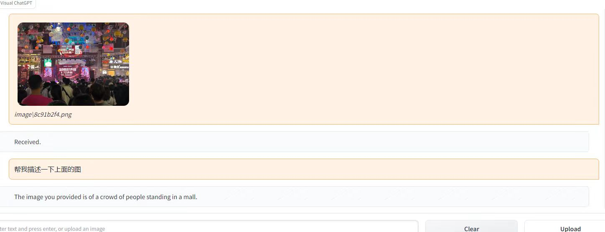
   - 让Visual ChatGPT判断疾病，这张图是湿疹的图片，GPT回答的大差不差。
   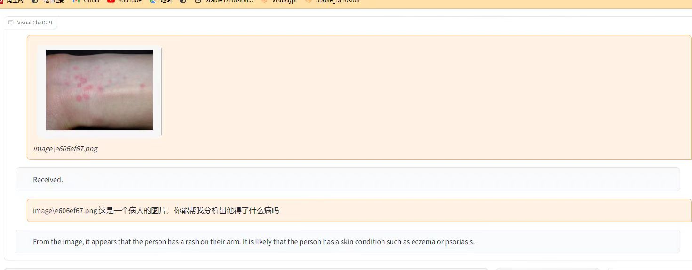
   - 让Visual ChatGPT判断X光片，图里的病人的X光片骨折了。GPT完美回答。
   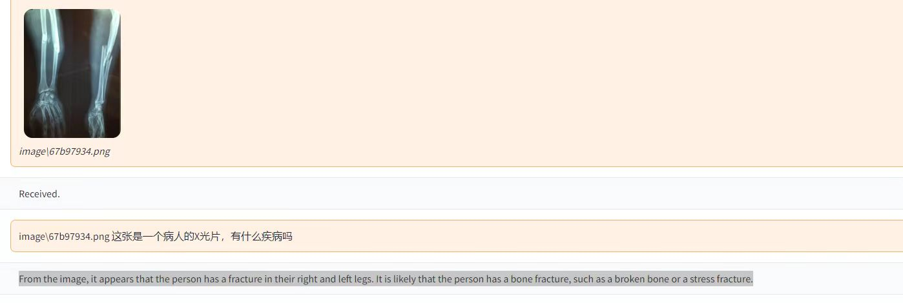

然后看以上生成的图片我发现一个问题，就是说目前他有一点小BUG，就比如说我在上文中提到了我想要和你说中文，但是说着说着他又会用英文和你交流，还有就是实际上这玩意好像暂时无法在图片里生成中文，参考我帮实验室生成的Logo，里面像是一些乱码或是罗马文之类的？

目前关于ChatGPT我大概做到的就是这些，后面会继续研究补充一些东西。ps：最近沙特的MiniChatGPT4非常的火，但是我的师兄说效果不行我没有配置，还有一个AutoGPT，那个也是个神一般的模型在我看来，你给一个任务，然后他会有两个GPT打架来互相纠错帮你完成这个任务，这真的很神奇，颇有一种找人给你打工的感觉，但是听说要收费，而且我也看到一些博客里面写到AutoGPT难以收敛（找不到最终的解决办法），我本人电脑算力也不足所以还没尝试，这里记录一下等以后AutoGPT版本稳定了可以做尝试。

## ChatGLM
自从ChatGLM出来以后，清华和智谱AI联手搞了一个模型叫做ChatGLM,ChatGLM目前又有两个版本，一个是[ChatGLM-6b](https://github.com/THUDM/ChatGLM-6B)，一个是[ChatGLM-130b](https://github.com/THUDM/GLM-130B)。ChatGLM-130b不是普通人家能玩起的。显存要求极高。
| **Hardware**    | **GPU Memory** | **Quantization** | **Weight Offload** |
| --------------- | -------------- | ---------------- | ------------------ |
| 8 * A100        | 40 GB          | No               | No                 |
| 8 * V100        | 32 GB          | No               | Yes (BMInf)        |
| 8 * V100        | 32 GB          | INT8             | No                 |
| 8 * RTX 3090    | 24 GB          | INT8             | No                 |
| 4 * RTX 3090    | 24 GB          | INT4             | No                 |
| 8 * RTX 2080 Ti | 11 GB          | INT4             | No                 |

你看看人家这拿来训练的显卡。我暂时就玩不起了，ChatGLM-130b一共有130亿参数，ChatGLM-6b面向普通群众的，参数量是62亿。也可以进行微调，这个后面会详细讲。我目前主要的探索都是基于ChatGLM-6b的模型的。**接下来的所有使用到的ChatGLM模型都是ChatGLM-6b**。
而ChatGLM又分为三个子版本：
- FP16无量化版本
- INT8量化版本
- INT4量化版本

ChatGLM-6b各个版本的显存要求如下所示：
| **量化等级**   | **最低 GPU 显存**（推理） | **最低 GPU 显存**（高效参数微调） |
| -------------- | ------------------------- | --------------------------------- |
| FP16（无量化） | 13 GB                     | 14 GB                             |
| INT8           | 8 GB                     | 9 GB                             |
| INT4           | 6 GB                      | 7 GB                              |

我的电脑目前是安装了INT8与INT4两个版本,FP16最低要求13G显存，所以我玩不了，运行的话就会有如下报错：
`OutOfMemoryError: CUDA out of memory`

ChatGLM的布置流程如下：
- 同样下载GIT，上文已经提到，这里不再过多赘述。
- `git clone https://huggingface.co/THUDM/chatglm-6b`
- 从Hugging face上下载模型，下载之后放在本地文件夹。
   - [ChatGLM-FP16](https://huggingface.co/THUDM/chatglm-6b)
   - [ChatGLM-INT8](https://huggingface.co/THUDM/chatglm-6b-int8)
   - [CHATGLM-INT4](https://huggingface.co/THUDM/chatglm-6b-int4)
- `cd ChatGLM-6B`
- 将文件中的`web_demo.py`文件和`cli_dem.py`文件中的模型参数改成本地模型，假设说上一步中的模型我下载在`D:\ChatGLM-INT8`,那么这里就是将模型中的`THUDM/ChatGLM-6B`替换为`D:\ChatGLM_INT8`。
- `conda activate {your_env_name}`启动虚拟环境
- `python web_demo.py` or `python cli_demo.py`

ChatGLM-6b INT8版本和INT4版本的效果差别感觉不是很大，我感觉INT8版本会更带有人类的感情一些。

这是INT8量化的ChatGLM-6b：

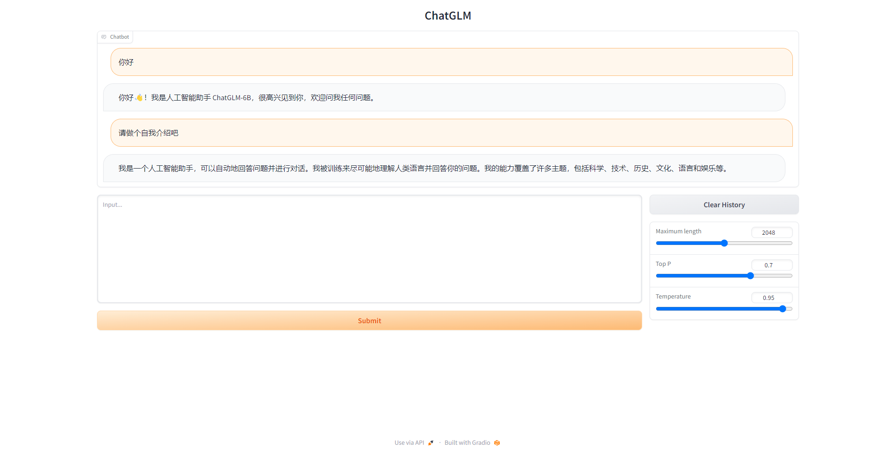

这是INT4量化的ChatGLM-6b：

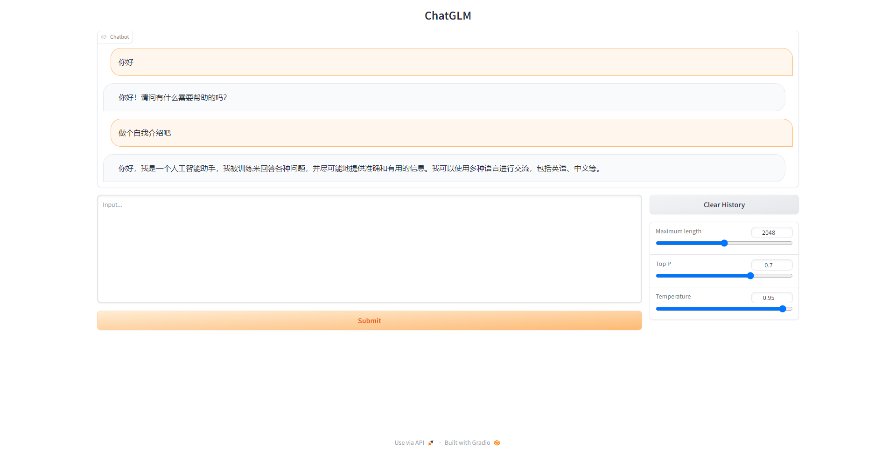

具体的大家配置好可以自己去尝试一下，我觉得这暂时是中文里面做的最好的了。实际上市面上还有一个竞品，[复旦的MOSS](https://github.com/OpenLMLab/MOSS)（流浪地球里的MOSS现实版），这个我没有配置，但是我的师兄配置在Lab了，据我所知效果不是很好，而且我电脑吃不太动，所以我没配置。感兴趣的同学可以点上面的链接自己配置一下玩。

MOSS的配置显存要求：
| 量化等级 | 加载模型 | 完成一轮对话（估计值） | 达到最大对话长度2048 |C
| -------- | -------- | ---------------------- | -------------------- |
| FP16     | 31GB     | 42GB                   | 81GB                 |
| Int8     | 16GB     | 24GB                   | 46GB                 |
| Int4     | 7.8GB    | 12GB                   | 26GB                 |

没什么好评价的，玩不起玩不起QAQ。

### ChatGLM的微调

接着说回来ChatGLM的微调，这个玩意比较有趣，也是目前很多人想要攻克的难题，据我所知现在很多人在做这个（北京的微调师的时薪是17刀!!），GLM强就强在入门级显卡可以实现微调，这是非常牛逼的，目前微调方法主要有三种：
- LoRA
- P-Tuning V2
- Freeze
有一个github大佬实现了三种方法集成的低秩微调方法，按照他的方法可以进行微调。[链接点这里](https://github.com/hiyouga/ChatGLM-Efficient-Tuning)。
但是这个微调对电脑要求很高，就算量化模型也要训练很久，据我所知官方50W的数据要用4090(24G显存)训练60小时（所以一般玩这个都是租服务器去玩，A100-80G版本一般租起来差不多是9块钱一个小时），我的显卡这两天已经跟我奔波了好久， 不想再折腾他了，所以这个方法还没去尝试，等詹老师把新的显卡搞来我再测试吧TAT。

微调的具体配置要求:

| Fine-tune method | Batch size | Mode |  GRAM  | Speed |
| ---------------- | ---------- | ---- | ------ | ----- |
| LoRA (r=8)       |     16     | FP16 |  28GB  | 8ex/s |
| LoRA (r=8)       |     8      | FP16 |  24GB  | 8ex/s |
| LoRA (r=8)       |     4      | FP16 |  20GB  | 8ex/s |
| LoRA (r=8)       |     4      | INT8 |  10GB  | 8ex/s |
| P-Tuning (p=16)  |     4      | FP16 |  20GB  | 8ex/s |
| P-Tuning (p=16)  |     4      | INT8 |  16GB  | 8ex/s |
| P-Tuning (p=16)  |     4      | INT4 |  12GB  | 8ex/s |
| Freeze (l=3)     |     4      | FP16 |  24GB  | 8ex/s |
| Freeze (l=3)     |     4      | INT8 |  12GB  | 8ex/s |

| RM  method       | Batch size | Mode |  GRAM  | Speed |
| ---------------- | ---------- | ---- | ------ | ----- |
| LoRA (r=8) + rm  |     4      | FP16 |  22GB  | -     |
| LoRA (r=8) + rm  |     1      | INT8 |  11GB  | -     |

| RLHF method      | Batch size | Mode |  GRAM  | Speed |
| ---------------- | ---------- | ---- | ------ | ----- |
| LoRA (r=8) + ppo |     4      | FP16 |  23GB  | -     |
| LoRA (r=8) + ppo |     1      | INT8 |  12GB  | -     |

目前还有一个模型的微调，那个算是一站式的整合包，是B站一个UP主整合的，[链接在这](https://www.bilibili.com/video/BV1P24y1L7Ge/?spm_id_from=333.337.search-card.all.click)。这个整合包是由数据集制作与模型调整两部分组成，**目前仅实现了LoRA的微调方法**，如果想分别查看实现方法可以查看下面的链接:
- [数据集制作](https://github.com/huang1332/finetune_dataset_maker)
- [模型微调](https://github.com/mymusise/ChatGLM-Tuning)
我暂时也使用了这个，只是用他的模型我的显存会报错不足，然后我把它调到我的本地模型上（微调这个地方要改的东西比较多），就会出现一些不知名的报错。
比如`Only Tensors of floating point and complex dtype can require gradients`，这个的解决方法就是ChatGLM最初始版本未作任何修改的替换到这里的代码就可以解决，然后我这里又遇到了一个`self and mat2 must have the same dtype`，这个BUG非常的神奇，我在Google上找了两天也没找到解决方法，后来我发现很多人也在官方的帖子下询问这个问题，看来这个BUG官方也不好轻易解决。加上我最近比较忙，所以这个微调我还没完成，等后面有空再去Debug或者还是等詹老师买的4090到了我尝试FP16版本吧。因为我看Google目前出问题的都是INT8和INT4量化版本（都是穷人TAT），所以FP16版本应该不会有啥大问题，而且FP16版本实际上在我电脑上运行起来了（Debug时候尝试的），只是显存不足报错了。

不过话说回来这个微调我混到了作者群里学习，我发现还是有很多问题，我总结了一下，大概以下几点：
- Over fitting，这里的过拟合和我们之前理解的不一样，他过于拟合问题的话就会照着你给的问题原模原样回答，不会去理解你问题和回答的意思。
- 训练遗忘，记得专业知识然后不记得怎么说话了，你问他数学很猛，但是问他你是谁他就不知道了
- 重复输出，回答问题会重复回答，比如说问他你是谁，他会说他是清华的聊天机器人ChatGLM-6bbbbbbbbbbbbbbbb.....

总的来说，微调就像一个小孩训练偏科，要我评价的话，做个不恰当的比喻：GPT4说高考能考到660，那么GLM就可以达到550，但是此时是数学110，英语110，微调以后总分仍然是550，但是数学130，英语90这种感觉。

### Visual-ChatGLM
既然有Visual ChatGPT，那么有没有Visual ChatGLM呢，我查了一下，发现还真有类似的模型，这其实就是Visual ChatGPT的“盗版”。他能实现文生图的功能。我折腾了很久，发现B站大佬已经做了整合包，[链接在这](https://www.bilibili.com/video/BV1Wa4y1V77o/?spm_id_from=333.999.0.0&vd_source=628628960a416b6de42d5c7fdc17a7fc)。然后这个模型是由三个部分构成的:
- ChatGLM
- StableDiffusion
- 爬虫程序（这里的爬虫程序是UP主自己做的，可以让ChatGLM去阅读网上的信息(CSDN,知乎，B站评论等等)后再回答我们）

在使用这个整合包之前需要先安装B站另一个AI绘画领域的大佬所作的整合包，[链接在这](https://www.bilibili.com/video/BV1iM4y1y7oA/?spm_id_from=333.999.0.0&vd_source=628628960a416b6de42d5c7fdc17a7fc)，下载之后照着配置就好。只要改个端口号就可以使用了，**需要说明的是绘画最少需要4G显存，所以按照我的显卡就是8+4(分给ChatGLM-8G进行交流，分给Stable Diffusion-4G绘画)**，大家可以根据自己要求来调整这个显存分配。接下来只要按照上面B站UP主的视频一步步配置就好了，非常简单，我就不多说了，直接看看效果吧。
- 让他帮我画一张女孩的照片
   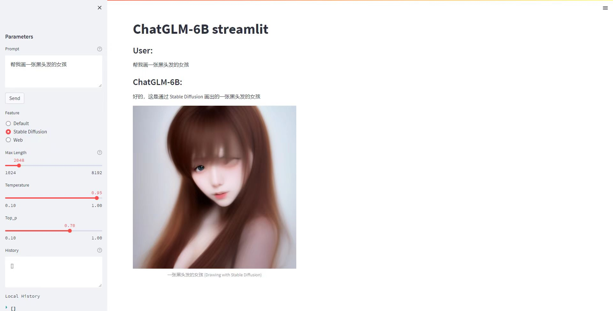
- 让他帮我画一张猫的照片
   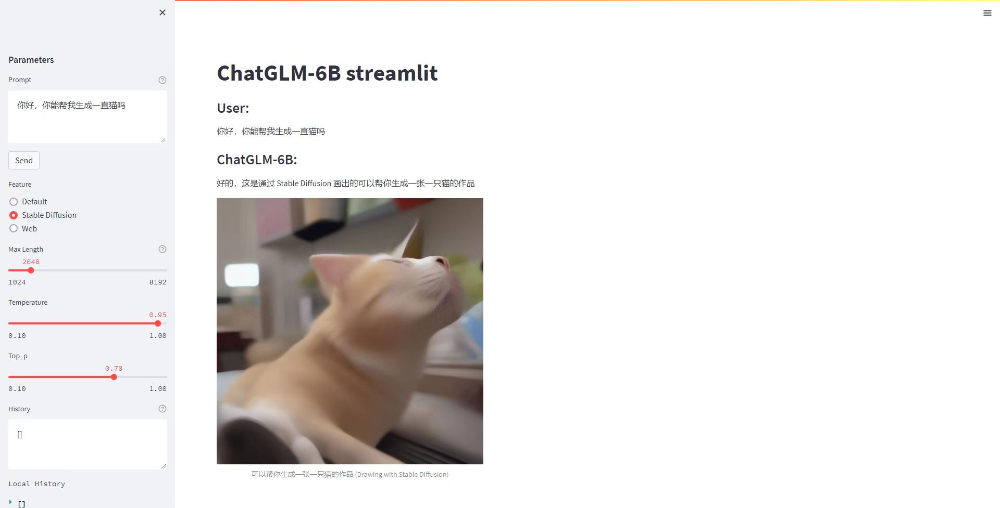
-让他帮我画穿着校服的女生
   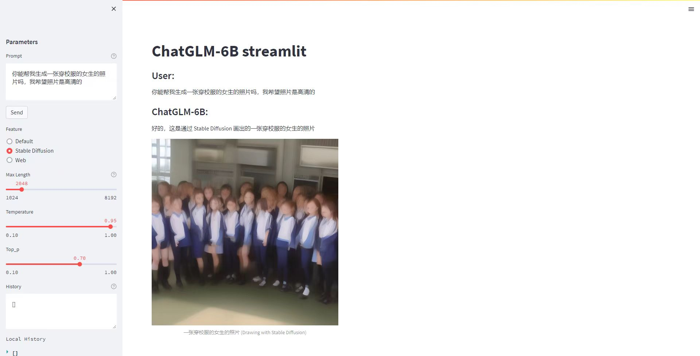
 
可以看到除了画猫效果都不是很好~~（有点恐怖谷效应）~~，我这里用的是INT8的模型，应该是模型的理解力所生成的提示词不行（生成图像所要用的提示词），效果和Viusal ChatGPT还是差了挺多的，不过改进的空间也很大。这个集成模型有趣的是他写了爬虫去了解网络实时信息，所以他可能懂的网络热梗比我还多呢。大家有兴趣的可以去自己配置玩一玩。

### LangChain-ChatGLM
这个也是一个重头戏，可以改进的东西很多的模型。这个模型是由智谱AI官方自己开发的一个知识图库的模型，[链接在这](https://github.com/imClumsyPanda/langchain-ChatGLM/tree/master)它可以根据本地的知识库去回答你的问题，再做一个不恰当的比喻。如果说ChatGLM是一个550分的学生的画，LangChain-ChatGLM就是给这个学生看了一本专业领域的书让他读完再来回答用户的问题。

项目实现原理如下图所示，过程包括加载文件 -> 读取文本 -> 文本分割 -> 文本向量化 -> 问句向量化 -> 在文本向量中匹配出与问句向量最相似的`top k`个 -> 匹配出的文本作为上下文和问题一起添加到`prompt`中 -> 提交给`LLM`生成回答。

从文档角度解释就是:

他的配置我也不多说了也是Git下来然后替换代码中的模型为本地模型就好了，这个很简单我就不多赘述~~（陆同学都会，不会的问他）~~

由于詹老师想要用这个给学校做一个客服机器人，所以我这两天也是喂进去了学校的文档（感谢师弟们的整理）看看效果，发现效果还不错，具体如下：
- 这是没有喂入文档的ChatGLM，不认识广州南方学院，胡说八道的很正经。ps：下面那个问题忽视一下嘻嘻嘻。
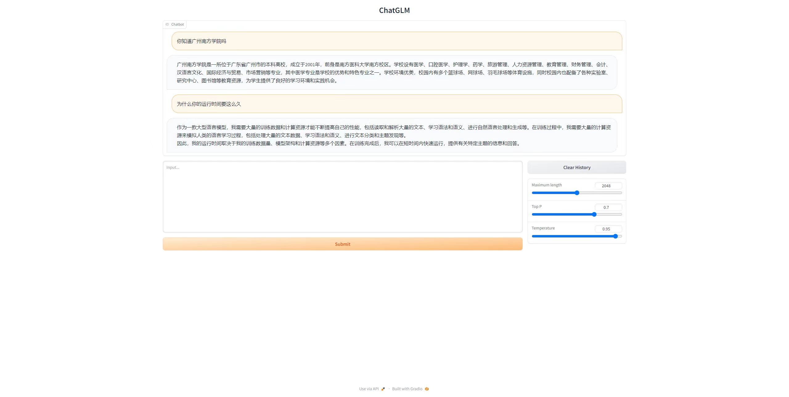
- 这是喂入了文档的ChatGLM，有问必答，告诉出处，雷厉风行。
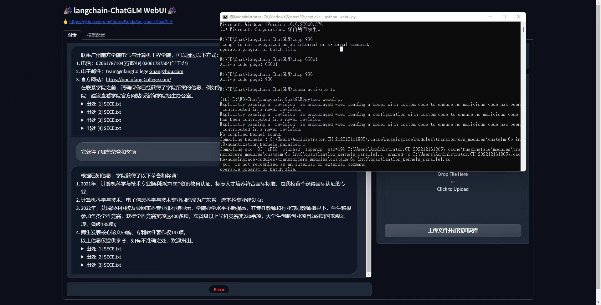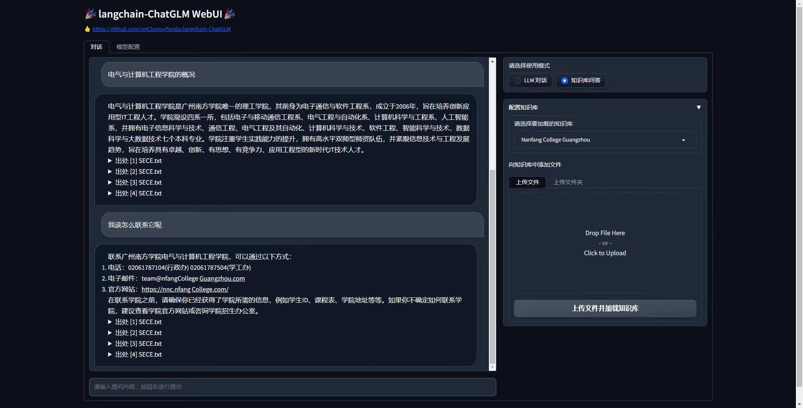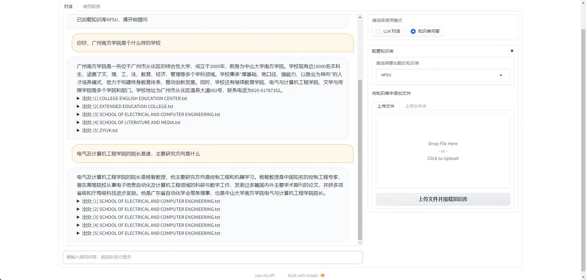
可以明显看到聪明了很多，基本的问题都回答了上来。效果还是很不错的，正当我觉得可以使用的时候：
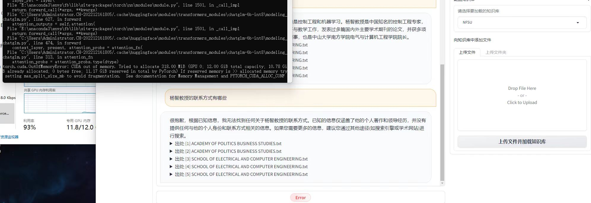
报错了....显存不足了，他要记住你的话需要大显存，我启动就已经花掉接近10G了，只有2G，当然记不住了..

Langchain-ChatGLM的上限非常的高，基本可以满足某个方向的问答，虽然还有一些错误存在（有时候他会给我创造一些自创的名字），但是这应该是输入文档的问题，只要把输入文档规范化基本就可以实现大差不差的效果。
- 文档中不要有太多的符号。
- 文档中最好是以介绍形式：詹老师任职与广州南方学院电气与计算机工程学院特评教授，主要成就有xx，联系方法是xx，主要论文有xx。

ps：我在某个群里看到别人拿他来练车辆工程的专业知识，专业人员表示GLM总结的很好很规范。可见上限之高。

##
总结：现在的模型上限之高能做到非常多的东西，包括客服，包括各种专业知识库，我最近也有听到风声有医药领域的人想要构建这样一个自己知识库（医药公司）。只要接下来好好挖掘，相信能得到一个不错的结果⛺。接下来我也会继续挖掘和更新。

最后彩蛋给大家放一点最近和詹老师生成的好看和有趣的图吧，真是太强了：
- 扩散生成:
   - 城市中的美女:
   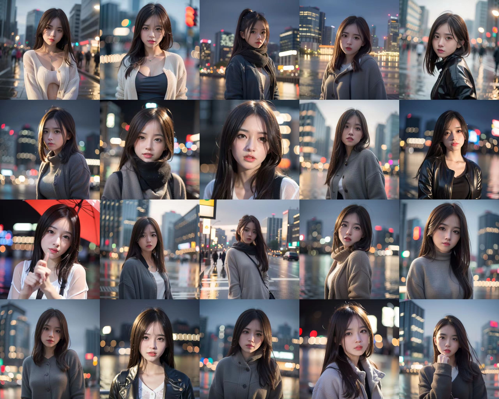
   - 熊猫战士：
   
   - 女巫~~（你不说我以为詹老师哪里截来的电影剧照）~~
   
- ControlNet涂色，他能实现很多内容，我这里只展示其中一种。实际上左边的线稿图也是扩散生成模型生成的。
！[Lora4](image/Lora3.jpg)

Author:林发冰 | Wechat:13205034032 | Date:2023.05.09
